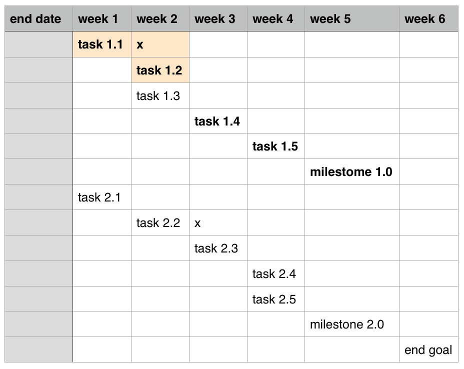

# Leadership

I would like to start this book with some of the qualities you will have to develop as a leader in order to succeed in your endeavors.

## Planning and goal setting

Learn to plan well. Always have a plan to achieve your next goal. Start by defining a clear end goal. Your goal may be a profitability, a new product, or a successful software development iteration. White board helps for initial brainstorming. Once you have a goal, break it into a list of milestones that you need to reach and pass to get there. Then, make a list a set of tasks you need to achieve each milestone. Break each tasks into smaller actionable subtasks that you can accomplish without difficulty. If any particular task is too long, or too grand, try to break it down further.

Simple Gantt chart, critical path in bold, dependencies makes by "x". Task 1.3 is not on critical path so it gets lesser priority, this could be preparation, or research task.

Get familiar with Gantt chart which graphically shows the progression of tasks towards the milestones. The tasks can overlap in time only if you can actually multitask, or you have multiple people working at the same time. It is important to clearly identify the dependencies between particular tasks. Your subtasks should be so detailed and easy to achieve in short period of time that traversing the Gantt chart should resemble the long stroll down the staircase. The only thing required should be persistence and the right resources.

### Critical Path

Define a critical path that is the shortest path of absolutely necessary things you need to do to achieve your end-goal. It is nice to have all the bells and whistles, but if they are not getting you directly to your goals, maybe you should not spend time on them.

Reference your plan often as it is very easy to get side-tracked by non-essential things that take you away from achieving your goals.

## Understand your limitations

### Surround yourself with smarter people

Nobody knows everything, surround yourself with people who are smarter than you in the areas that help you accomplish your goals. Hire people who know stuff you do not.

Keeping bad apples is a costly mistake. Try to address bad hiring decisions as soon as possible before it affects your whole team.

### Delegate

In addition to surrounding yourself with people who know more about things that you do not, you also need to delegate tasks smartly. You cannot and should not do everything yourself. You should try to learn the task yourself and then once proficient, delegate it to others so they can take it to the new level. 

Your time should be spent creatively. As a leader, you should always find ways to improve things, if you are stuck in a spreadsheets, or emails, managing day-to-day operations you are improving nothing. Sooner or later you will need to be replaced by someone with "bigger picture".

## Educate people

Always educate people. Keeping knowledge to yourself makes you a star with a one way ticket out.

Your boss or client needs to answer his bosses smartly. You need to answer your boss and your team has to provide you with smart answers. New employees need education. Keep the information flow always going, always improving. Document things and keep the knowledge current. Audits happen and lack of knowledge base is a sign of weak leadership.

Expect your team to have the same approach and constantly educate you.

## Always improve the process

Never be too busy to improve the process. Not having time to improve the process is a sign of bad time management. Not having ideas how to improve the current process does not mean that the process is perfect, it only means you and your team are not looking hard enough.

## Succeed as a manager

A successful leader is measured by the team he builds, if the team grows and improves to a point the manager is no longer needed then it is a real sucess. There will always be next, better challenge for a great leader. There were plenty of companies and even empires that failed as soon as the leader was no longer there. From the point of view of people left behind and experiencing the fall it was a leadership failure. Having a great run at the cost of the people left behind is a sign of a weak personality.

You lead with what you contribute, not with your title, not even with your knowledge, or potential for greatness, you can be very smart, but this not mean you are fit to be a leader.

Have mental strengtth and balance, be exacting. To be exacting is to be precise what you require from others and expect exact results.

Lead with respect, justice and understanding and cooperation, not brute force.

Provide service to your team, be humble.

Always do more than is required of you.

## Loyalty

Be loyal to your team and expect the same.

## Mastery vs Success

Success is the end result of your efforts, some people live for the sake of glory, but these people are usually not your best friends and often their character is questionable.

 The mastery is the perfection of the process, constant improvement. For a person to master the process one has to be a good listener, a good friend to whom people are willing to talk, one has to be open minded and focused at the same time, one has to persistent to achieve, but self-critical to know when to pivot and change mind. You can always change your plans, but keep your eyes on the right goal.

